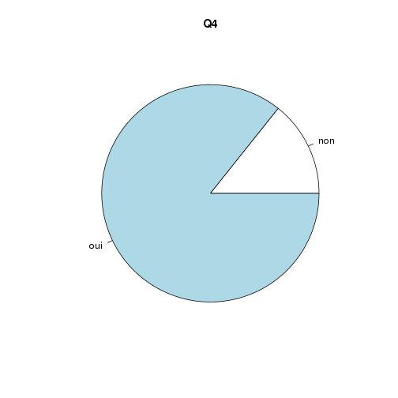
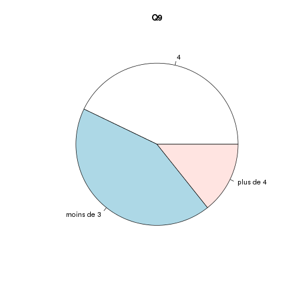
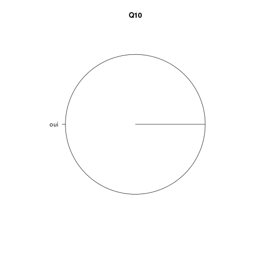
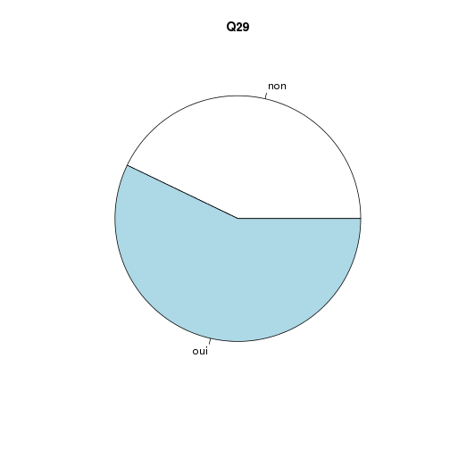
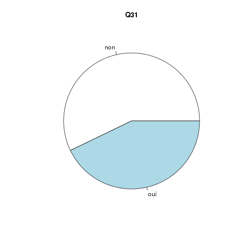
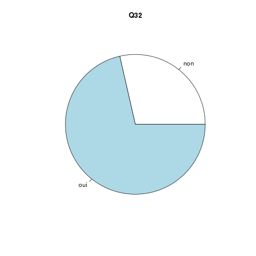
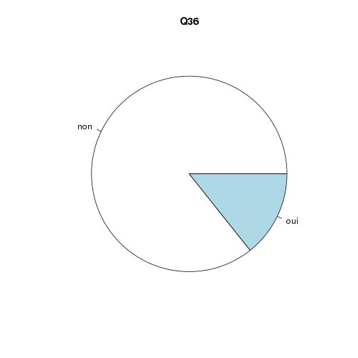

Enquete SMUR
========================================================

date: septembre 2013

objet: évaluer les dotations SMUR par rapport aux recommandations2013 de la SFMU

init: on récupère le fichier brut et on procède au corrections suivantes:
- sauvegarde des noms de colonne dans le vecteur *x* pour une exploitation ultérieure. Les "." séparant les mots sont remplaçés par des espaces
- simplification des noms de colonnes: les 3 prmières identifient l'origine, toutes les suivantes sont transformées en question *Qx* avec la fonction *paste*.
- suppression de la colonne 46
suppression de la ligne 4 (2 réponses pour Strasbourg)


```r
file <- "Enquete_SMUR.csv"
sm <- read.csv(file, header = TRUE, sep = ",")
x <- names(sm)
x <- x[-c(1:3, 46)]
x <- gsub(".", " ", x, fixed = TRUE)
a <- c("date", "origine", "SMUR", paste("Q", 1:43, sep = ""))
# ajout d'une colonne ESO (essentiel, souhaitable, optionnel)
mat <- "EEEEEEEESESEEESOEEEEEESEESEESSEEEEEESESSEE"
mat <- unlist(strsplit(mat, NULL))
summary(as.factor(mat))
```

```
##  E  O  S 
## 31  1 10
```

```r

names(sm) <- a
x
```

```
##  [1] "Respirateur de transport permettant les modes de VNI"                                                                                                                 
##  [2] "Système alternatif à l intubation dans chaque véhicule opérationnel"                                                                                                  
##  [3] "Manomètre pour le monitorage de la pression du ballonet de la sonde d intubation"                                                                                     
##  [4] "Appareil de mesure du monoxyde de carbone expiré ou saturomètre HbCO"                                                                                                 
##  [5] "Monitorage de l oxymétrie pulsée"                                                                                                                                     
##  [6] "Détecteurs de monoxyde de carbone atmosphérique"                                                                                                                      
##  [7] "Monitorage scope  ECG  PNI"                                                                                                                                           
##  [8] "Pousse seringue éléctrique"                                                                                                                                           
##  [9] "Quantité de pousse seringue éléctrique"                                                                                                                               
## [10] "Dispositif de cathéterisme intra osseux adulte et pédiatrique"                                                                                                        
## [11] "Dispositif permettant le monitorage de la pression artérielle invasive et de la pression intra crânienne  au moins une unité par base SMUR "                          
## [12] "Dispositif permettant le monitorage du CO2 expiré en continue avec représentation graphique"                                                                          
## [13] "Aimant pour contrôle des dispositifs implantés"                                                                                                                       
## [14] "Planche à masser automatisée"                                                                                                                                         
## [15] "Dispositif d assistance circulatoire transportable"                                                                                                                   
## [16] "Médicaments et dispositifs médicaux pour la réanimation des défaillances respiratoires  circulatoires ou neurologiques"                                               
## [17] "Différents solutés de perfusion et de remplissage"                                                                                                                    
## [18] "Analgésiques  sédatifs  antibiotiques  catécholamines  médicaments à visée cardio vasculaire  thrombolytique  antiagrégant  anticoagulant     et principaux antidotes"
## [19] "Dispositif de type réfrigérateur"                                                                                                                                     
## [20] "Appareil d échographie portable"                                                                                                                                      
## [21] "Garrot pneumatique"                                                                                                                                                   
## [22] "Dispositif permettant le monitorage continu du rythme cardiaque foetal"                                                                                               
## [23] "Appareil de mesure de la glycémie capillaire"                                                                                                                         
## [24] "Appareil de mesure de l hémoglobine capillaire type Hémocue "                                                                                                         
## [25] "Appareil de biologie embarquée  kaliémie  lactases  gaz du sang "                                                                                                     
## [26] "Thermomètre hypothermique"                                                                                                                                            
## [27] "Dispositif permettant le monitorage de la température centrale"                                                                                                       
## [28] "Thermomètre pour contrôle intérieur des véhicules"                                                                                                                    
## [29] "Obus de MEOPA"                                                                                                                                                        
## [30] "L ensemble des consommables est il de plusieurs tailles  "                                                                                                            
## [31] "Incubateur de transport avec servo contrôle de la température"                                                                                                        
## [32] "Sacs en polyéthylène  lutte contre l hypothermie   bonnets"                                                                                                           
## [33] "Défibrillateur avec palettes pédiatriques et énergie réglable en fonction du poids de l enfant  atténuateur "                                                         
## [34] "Respirateur néonatal et pédiatrique de transport permettant la ventilation en pression et ou volume contrôlé ainsi que la VNI"                                        
## [35] "Oxymètre de pouls  SpO2  avec capteur adapté pouvant être complété par un appareil de mesure des PO2 et PCO2 transcutanées pour le nouveau né"                        
## [36] "Dispositif de transillumination thoracique"                                                                                                                           
## [37] "Cathéters ombilicaux et matériels pour mise en place"                                                                                                                 
## [38] "Appareil de mesure du taux des lactates"                                                                                                                              
## [39] "Obus de monoxyde d azote et système de monitorage  NO et NO2 "                                                                                                        
## [40] "Médicaments spécifiques   Surfactant exogène  Prostine"                                                                                                               
## [41] "Commentaires"                                                                                                                                                         
## [42] "e mail"
```

```r
sm <- sm[-46]
sm <- sm[-4, ]
str(sm)
```

```
## 'data.frame':	7 obs. of  45 variables:
##  $ date   : Factor w/ 8 levels "01/09/2013 08:08:15",..: 4 5 6 8 1 2 3
##  $ origine: Factor w/ 8 levels "Centre Hospitalier Haguenau\nZIMPFER Mathieu\nCadre de Santé\nSAU-SMUR",..: 2 8 5 6 3 7 1
##  $ SMUR   : Factor w/ 8 levels "COLMAR","HAGUENAU 67",..: 1 8 7 5 3 4 2
##  $ Q1     : Factor w/ 1 level "oui": 1 1 1 1 1 1 1
##  $ Q2     : Factor w/ 1 level "oui": 1 1 1 1 1 1 1
##  $ Q3     : Factor w/ 2 levels "non","oui": 1 1 1 1 1 1 2
##  $ Q4     : Factor w/ 2 levels "non","oui": 2 1 2 2 2 2 2
##  $ Q5     : Factor w/ 1 level "oui": 1 1 1 1 1 1 1
##  $ Q6     : Factor w/ 1 level "oui": 1 1 1 1 1 1 1
##  $ Q7     : Factor w/ 1 level "oui": 1 1 1 1 1 1 1
##  $ Q8     : Factor w/ 1 level "oui": 1 1 1 1 1 1 1
##  $ Q9     : Factor w/ 3 levels "4","moins de 3",..: 1 1 2 1 2 2 3
##  $ Q10    : Factor w/ 1 level "oui": 1 1 1 1 1 1 1
##  $ Q11    : Factor w/ 2 levels "non","oui": 1 1 1 2 2 1 2
##  $ Q12    : Factor w/ 1 level "oui": 1 1 1 1 1 1 1
##  $ Q13    : Factor w/ 2 levels "non","oui": 2 2 2 1 1 2 2
##  $ Q14    : Factor w/ 2 levels "non","oui": 2 1 1 1 1 1 1
##  $ Q15    : Factor w/ 1 level "non": 1 1 1 1 1 1 1
##  $ Q16    : Factor w/ 1 level "oui": 1 1 1 1 1 1 1
##  $ Q17    : Factor w/ 1 level "oui": 1 1 1 1 1 1 1
##  $ Q18    : Factor w/ 1 level "oui": 1 1 1 1 1 1 1
##  $ Q19    : Factor w/ 1 level "oui": 1 1 1 1 1 1 1
##  $ Q20    : Factor w/ 1 level "non": 1 1 1 1 1 1 1
##  $ Q21    : Factor w/ 2 levels "non","oui": 2 1 1 1 1 1 1
##  $ Q22    : Factor w/ 1 level "non": 1 1 1 1 1 1 1
##  $ Q23    : Factor w/ 1 level "oui": 1 1 1 1 1 1 1
##  $ Q24    : Factor w/ 2 levels "non","oui": 1 2 1 1 2 1 2
##  $ Q25    : Factor w/ 1 level "non": 1 1 1 1 1 1 1
##  $ Q26    : Factor w/ 1 level "oui": 1 1 1 1 1 1 1
##  $ Q27    : Factor w/ 2 levels "non","oui": 1 1 1 1 2 1 1
##  $ Q28    : Factor w/ 2 levels "non","oui": 2 1 2 1 1 2 2
##  $ Q29    : Factor w/ 2 levels "non","oui": 1 2 2 1 1 2 2
##  $ Q30    : Factor w/ 1 level "oui": 1 1 1 1 1 1 1
##  $ Q31    : Factor w/ 2 levels "non","oui": 1 1 2 1 2 1 2
##  $ Q32    : Factor w/ 2 levels "non","oui": 2 2 2 1 2 1 2
##  $ Q33    : Factor w/ 2 levels "non","oui": 1 2 2 2 2 2 2
##  $ Q34    : Factor w/ 2 levels "non","oui": 2 2 2 1 2 2 1
##  $ Q35    : Factor w/ 2 levels "non","oui": 1 2 2 2 2 1 2
##  $ Q36    : Factor w/ 2 levels "non","oui": 2 1 1 1 1 1 1
##  $ Q37    : Factor w/ 2 levels "non","oui": 1 1 1 2 1 1 1
##  $ Q38    : Factor w/ 1 level "non": 1 1 1 1 1 1 1
##  $ Q39    : Factor w/ 1 level "non": 1 1 1 1 1 1 1
##  $ Q40    : Factor w/ 1 level "non": 1 1 1 1 1 1 1
##  $ Q41    : Factor w/ 7 levels "","- Appareil de mesure du monoxyde de carbone expiré ou saturomètre HbCO : dispo chez les pompiers !\n- Quantité de pousse sering"| __truncated__,..: 5 2 7 6 3 1 1
##  $ Q42    : Factor w/ 8 levels "christiane.walter@chru-strasbourg.fr",..: 8 7 4 3 5 2 6
```

```r
for (i in 1:40) {
    print(paste("Question ", i, " (", mat[i], ")", sep = ""))
    print(x[i])
    pie(table(sm[i + 3]), main = paste("Q", i, sep = ""))
}
```

```
## [1] "Question 1 (E)"
## [1] "Respirateur de transport permettant les modes de VNI"
```

 

```
## [1] "Question 2 (E)"
## [1] "Système alternatif à l intubation dans chaque véhicule opérationnel"
```

 

```
## [1] "Question 3 (E)"
## [1] "Manomètre pour le monitorage de la pression du ballonet de la sonde d intubation"
```

 

```
## [1] "Question 4 (E)"
## [1] "Appareil de mesure du monoxyde de carbone expiré ou saturomètre HbCO"
```

 

```
## [1] "Question 5 (E)"
## [1] "Monitorage de l oxymétrie pulsée"
```

 

```
## [1] "Question 6 (E)"
## [1] "Détecteurs de monoxyde de carbone atmosphérique"
```

 

```
## [1] "Question 7 (E)"
## [1] "Monitorage scope  ECG  PNI"
```

 

```
## [1] "Question 8 (E)"
## [1] "Pousse seringue éléctrique"
```

 

```
## [1] "Question 9 (S)"
## [1] "Quantité de pousse seringue éléctrique"
```

 

```
## [1] "Question 10 (E)"
## [1] "Dispositif de cathéterisme intra osseux adulte et pédiatrique"
```

 

```
## [1] "Question 11 (S)"
## [1] "Dispositif permettant le monitorage de la pression artérielle invasive et de la pression intra crânienne  au moins une unité par base SMUR "
```

 

```
## [1] "Question 12 (E)"
## [1] "Dispositif permettant le monitorage du CO2 expiré en continue avec représentation graphique"
```

 

```
## [1] "Question 13 (E)"
## [1] "Aimant pour contrôle des dispositifs implantés"
```

 

```
## [1] "Question 14 (E)"
## [1] "Planche à masser automatisée"
```

 

```
## [1] "Question 15 (S)"
## [1] "Dispositif d assistance circulatoire transportable"
```

 

```
## [1] "Question 16 (O)"
## [1] "Médicaments et dispositifs médicaux pour la réanimation des défaillances respiratoires  circulatoires ou neurologiques"
```

 

```
## [1] "Question 17 (E)"
## [1] "Différents solutés de perfusion et de remplissage"
```

 

```
## [1] "Question 18 (E)"
## [1] "Analgésiques  sédatifs  antibiotiques  catécholamines  médicaments à visée cardio vasculaire  thrombolytique  antiagrégant  anticoagulant     et principaux antidotes"
```

 

```
## [1] "Question 19 (E)"
## [1] "Dispositif de type réfrigérateur"
```

 

```
## [1] "Question 20 (E)"
## [1] "Appareil d échographie portable"
```

 

```
## [1] "Question 21 (E)"
## [1] "Garrot pneumatique"
```

 

```
## [1] "Question 22 (E)"
## [1] "Dispositif permettant le monitorage continu du rythme cardiaque foetal"
```

 

```
## [1] "Question 23 (S)"
## [1] "Appareil de mesure de la glycémie capillaire"
```

 

```
## [1] "Question 24 (E)"
## [1] "Appareil de mesure de l hémoglobine capillaire type Hémocue "
```

 

```
## [1] "Question 25 (E)"
## [1] "Appareil de biologie embarquée  kaliémie  lactases  gaz du sang "
```

 

```
## [1] "Question 26 (S)"
## [1] "Thermomètre hypothermique"
```

 

```
## [1] "Question 27 (E)"
## [1] "Dispositif permettant le monitorage de la température centrale"
```

 

```
## [1] "Question 28 (E)"
## [1] "Thermomètre pour contrôle intérieur des véhicules"
```

 

```
## [1] "Question 29 (S)"
## [1] "Obus de MEOPA"
```

 

```
## [1] "Question 30 (S)"
## [1] "L ensemble des consommables est il de plusieurs tailles  "
```

 

```
## [1] "Question 31 (E)"
## [1] "Incubateur de transport avec servo contrôle de la température"
```

 

```
## [1] "Question 32 (E)"
## [1] "Sacs en polyéthylène  lutte contre l hypothermie   bonnets"
```

 

```
## [1] "Question 33 (E)"
## [1] "Défibrillateur avec palettes pédiatriques et énergie réglable en fonction du poids de l enfant  atténuateur "
```

 

```
## [1] "Question 34 (E)"
## [1] "Respirateur néonatal et pédiatrique de transport permettant la ventilation en pression et ou volume contrôlé ainsi que la VNI"
```

 

```
## [1] "Question 35 (E)"
## [1] "Oxymètre de pouls  SpO2  avec capteur adapté pouvant être complété par un appareil de mesure des PO2 et PCO2 transcutanées pour le nouveau né"
```

 

```
## [1] "Question 36 (E)"
## [1] "Dispositif de transillumination thoracique"
```

 

```
## [1] "Question 37 (S)"
## [1] "Cathéters ombilicaux et matériels pour mise en place"
```

 

```
## [1] "Question 38 (E)"
## [1] "Appareil de mesure du taux des lactates"
```

 

```
## [1] "Question 39 (S)"
## [1] "Obus de monoxyde d azote et système de monitorage  NO et NO2 "
```

 

```
## [1] "Question 40 (S)"
## [1] "Médicaments spécifiques   Surfactant exogène  Prostine"
```

 

